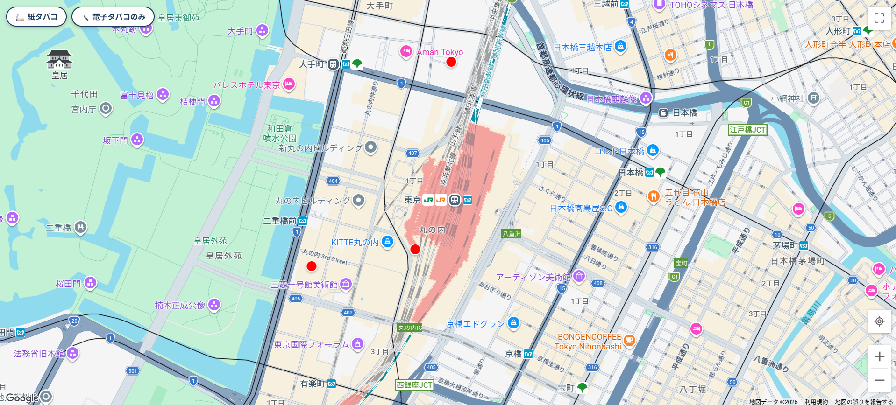
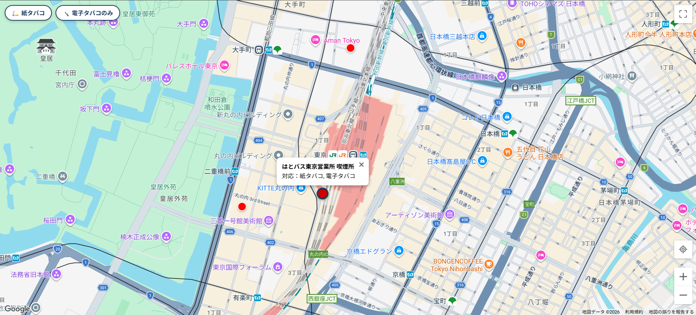
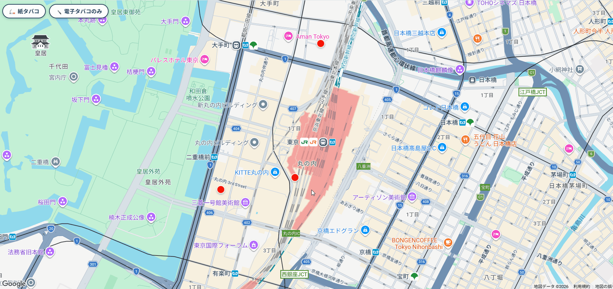
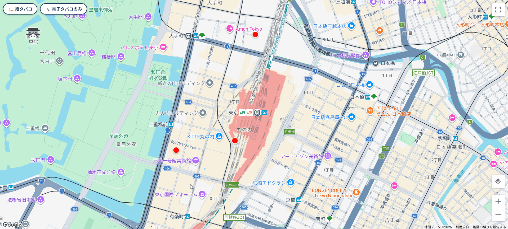
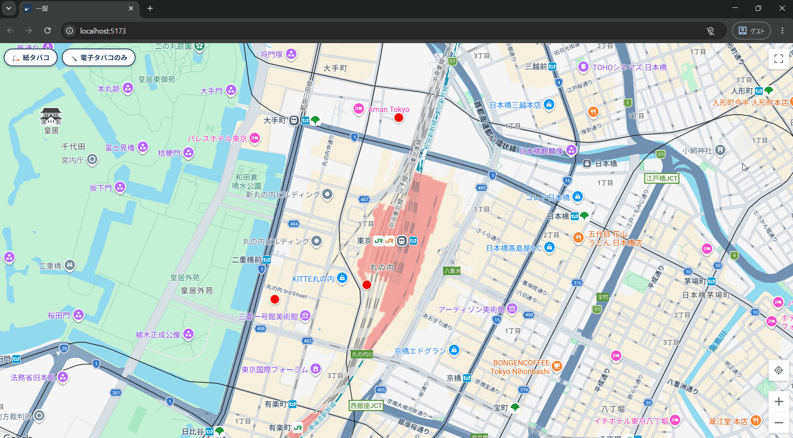
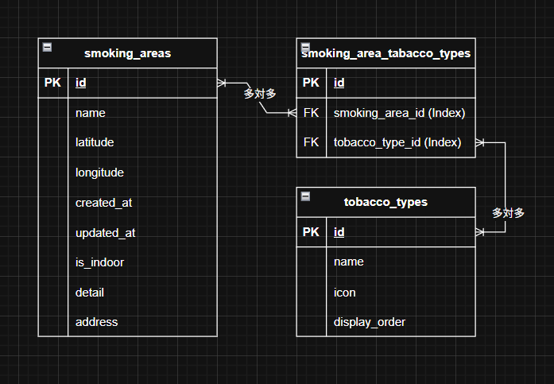

# 一服 🚬

サービスURL：https://ippuku.onrender.com

### 喫煙者が位置情報を活用して喫煙所を検索できるアプリケーション

ユーザーは位置情報を利用して、現在地付近にある喫煙所を探すことができます。
また喫煙所毎に違う対応タバコ種別を確認することで、吸いたいタバコを吸える喫煙所を知ることもできます。
ユーザーが現在地周辺にある喫煙所を見つけられることで、喫煙者がマナーを守り、喫煙者と非喫煙者の双方が安心して過ごせるまちづくりを目指すサービスになります。

## 開発背景

私は大学生の時、K-POPが好きで全国各地で行われるイベントに参加していました。知らない街に行くと喫煙所を探すのに苦労しました。都内でも普段行かない街に行くと同じように喫煙所を見つけられません。  
喫煙所が近くあったとしても、また街中や設置されている地図を見ても喫煙所の表記はなく、見つけるのは一苦労の場合が多くありました。  
知人からも喫煙所が見つからず歩き回ることが多いと相談されることもありました。  
また非喫煙者の知人からは近くに喫煙所があるのに路上喫煙をしている人がいて迷惑と言われることもありました。実際私も見かけたことがあります。  
タバコを吸わない人にとって迷惑ならないよう配慮するために喫煙所があります。  
これらの改善策として喫煙所がある場所を知る。これが一番の解決策だと思っており、マナーを守る。これは喫煙者に課せられる責務です。  
この課題解決のためにすでにリリースされている喫煙所を探すアプリがありますが、使用感が良くないと感じています。喫煙所の情報が古く既に喫煙所がなかったり、喫煙所のある場所がわかりにくく、たどり着くのに一苦労するなどの課題がありました。  
なので一番の解決策である喫煙所の場所を知る。そして喫煙所の情報を正しく表示し、喫煙所までたどり着きやすくする。そうすることで喫煙者が周りに配慮し、喫煙者と非喫煙者がお互いに安心して過ごすことができる。喫煙者の意識や行動でそれを可能にできると思いこのサービスを開発しました。

## 主要な機能

- 喫煙所の一覧表示
- 喫煙所の名前・対応タバコ種別表示機能
- タバコ種別フィルター機能
- 全画面表示・表示解除ボタン
- 現在地取得・現在地復帰ボタン

### 喫煙所の一覧表示



GoogleMap上に喫煙所（マーカー）が表示されます。

### 喫煙所の名前・対応タバコ種別表示機能



喫煙所（マーカー）をクリックするとその喫煙所の名前と吸えるタバコの種類が表示されます。

### タバコ種別フィルター機能

#### 紙タバコフィルター



対応タバコ種別に紙タバコがある喫煙所に絞り込みます。電子タバコが含まれていても、紙タバコがあれば表示されます。

#### 電子タバコのみフィルター



対応タバコ種別が電子タバコのみの喫煙所に絞り込みます。紙タバコを含まない喫煙所のみを表示します。

### 全画面表示・表示解除ボタン



ボタンをクリックすると画面いっぱいにMapが表示されるようになり、再度クリックすると表示が戻ります。

### 現在地取得・現在地復帰ボタン


現在地の取得を許可するとユーザーの現在地を中心にMapが表示されます。  
また現在地復帰ボタンをクリックすると現在地が中心になるようMapの表示が戻ります。

## 使用技術

| カテゴリ | 技術 |
| :----- | :---- |
| フロントエンド | React 19.2.0 / TypeScript 5.9.3 / Vite 7.2.4 |
| バックエンド | Ruby 3.3.0 / Ruby on Rails 7.1.5（APIモード） |
| データベース | PostgreSQL 16.14 |
| インフラ | Render（Static Site / Web Service） |
| 地図 | @vis.gl/react-google-maps 1.8.1 |
| テスト | Vitest 4.1.8 / React Testing Library 16.3.2 / RSpec |
| バリデーション | zod 4.4.3 |
| Lintツール | ESLint |

### 技術選定理由

#### フロントエンド

喫煙所検索サービスは地図を使用するため、ページ遷移の必要がなくなります。さらに画面の状態変化が多くなるためReactを使用したシングルページアプリケーション（SPA）が最適と判断しました。  
また喫煙所やタバコ種別に関するデータなど多数のデータを扱うことが想定され、データの正確性も求められるため型安全性と開発時の自動補完を利用し、データを扱う際に予期せぬバグが発生するリスクを減少させたいと考えTypeScriptを導入しました。

#### バックエンド

「設定より規約」の原則に則りコードの記述量や詳細な設定を減らすことで開発時間の短縮ができると思いRailsを採用しました。  
また喫煙所やタバコデータの取得がAPIに依存するためRESTfulな設計にできると思ったのも採用に至った理由です。

#### データベース

Railsとの親和性の高さや、喫煙所やタバコに関する多様なデータを扱いやすいPostgreSQLを採用しました。

#### インフラ

デプロイ先をRenderに統一することでデプロイの管理を容易にし、バックエンドをWeb service、フロントエンドをStatic siteにすることでそれぞれの性質に適した環境で動かすほうが合理的と判断しました。

#### その他

zodは型が存在しないRailsから取得したデータが意図している型かどうかを判別するために採用しました。フロントエンドではTypeScriptを使っていますが、取得したデータそのものの型が意図しない型だった場合に意図しない型の状態で表示することなくエラーとして表示でき、TypeScriptではできないAPIレスポンスの型判別を可能にしました。

## ER図



## ローカル環境での立ち上げ方法

### リポジトリのクローン
```bash
git clone https://github.com/Deku-toshi/smoking_area_map_api.git
cd smoking_area_map_api
```

### 環境変数の設定

**バックエンド**（`smoking_area_map_api/.env.local`）
```bash
DATABASE_PASSWORD=<任意のパスワードを入れてください>
```

**フロントエンド**（`smoking_area_map_api/frontend/.env.local`）
```bash
VITE_GOOGLE_MAPS_API_KEY=<取得したGoogleMapsAPIキーを入れてください>
VITE_GOOGLE_MAPS_MAP_ID=<取得したMapIDを入れてください>
```

### Rails API（バックエンド）
```bash
cd smoking_area_map_api
bundle install
rails db:create db:migrate
rails db:seed
rails s
```

### フロントエンド
```bash
cd smoking_area_map_api/frontend
npm install
npm run dev
```

## 今後の開発予定

今後、以下の機能を実装予定です。
- ユーザー登録機能
- メールアドレス認証
- 喫煙所登録機能
- 喫煙所の詳細閲覧機能
- 喫煙所の編集機能
- コメント投稿機能（ユーザーが喫煙所ごとに情報を追加できる）
- 施設名検索機能（検索した施設周辺の喫煙所を探すことができる）
- 喫煙所の設置場所による区別（公共施設内、飲食店、コンビニなど）
- 喫煙所、ユーザー、コメント、写真への報告機能
- 喫煙所のステータス機能（閉鎖中や利用停止中など利用不可のものと利用可能なものとの判別を可能にする）
- 屋内外、喫煙所の設置場所による絞り込み機能
- 管理者機能（管理者専用画面を作成し、喫煙所の登録許可や削除、ユーザーによる報告の対応）
